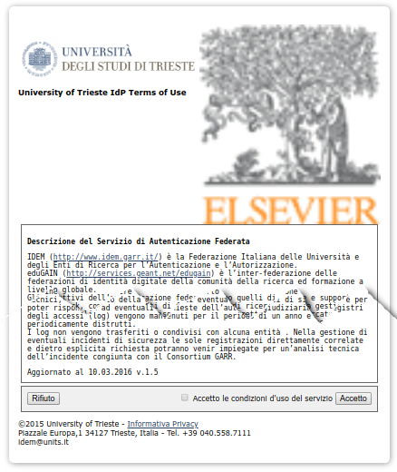
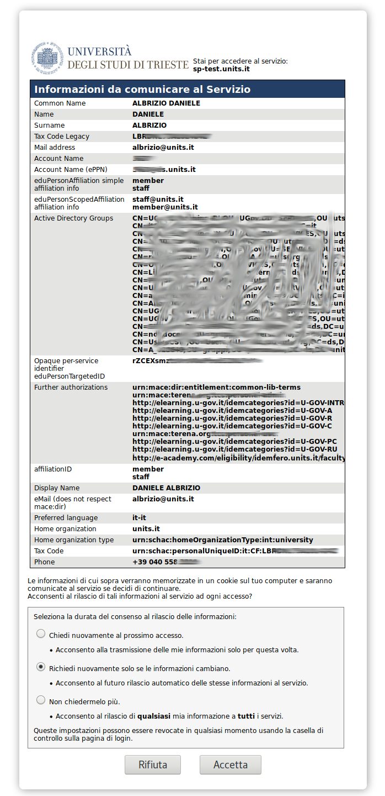
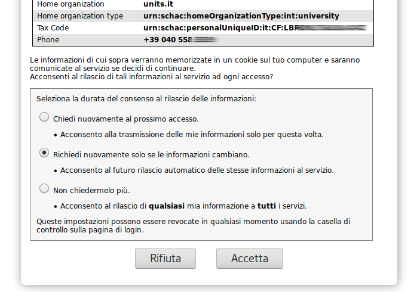

<span class="menu-title" style="display: none">Introduction</span>
## Migrazione da IdP v2 a v3
##### <span style="font-family:Helvetica Neue; font-weight:bold">Aggiornamento IdP e nuovi standard</span>
Daniele Albrizio - albrizio@units.it - IDEM Day 2018

 
---


<span class="menu-title" style="display: none">Perché migrare</span>
## Perché migrare
* versione 2 > EoL 31.7.2016
* Cogliere l'occasione per abbandonare SAML1 in favore di SAML2
* GDPR compliance

---


<span class="menu-title" style="display: none">GDPR</span>
## Consenso esplicito
* Consent
 * Informativa (ToU) al primo accesso
 * Consenso al rilascio degli attributi prima di rilasciarli all'SP insieme al
 * link all'informativa sul trattamento dati dell'SP (se pubblicato nei metdati dell'SP - mdui:PrivacyStatementURL)

---

## Consenso esplicito
* **Scelta** dell'utente **registrata** nel log.
* I consensi specifici restano in un **coockie sicuro** sul browser (a scadenza programmabile lato IdP).
* **Al cambiare** del testo nel ToU (hash) o del set di attributi da rilasciare, può essere *ripresentata la pagina di consenso automaticamente*.

---


+++

+++

+++



---


<span class="menu-title" style="display: none">Nuova architettura</span>

## Nova arcihtettura

* Container passa da Tomcat a Jetty
 * Molto più leggero. Più immediato per chi non ha esperienza di Tomcat.
* OpenJDK
* Secure cookies client-side
 * rigenerare con seckeygen a cron ogni giorno la chiave di cifratura


---

<span class="menu-title" style="display: none">Fringe benefits</span>

## Fringe benefits

* Miglior supporto ldap/AD
 * connection pooling
 * ldap backend type distinti fra openldap e AD

* Miglior supporto dei backend database
 * gestione migliore del failover


---


## Fringe benefits

* idp-process.log: Messaggi di warning molto più chiari
* Condizioni di errore user-facing maggiormente gestite (user experience più confortevole)
* Interfaccia utente in responsive web design (per tutti i dispositivi)
 * Interfaccia completamente (e facilmente) internazionalizzabile
 * Testo delle pagine modificabile runtime (reload automatico)


---


## Fringe benefits


* FileBackedHTTPMetadataProvider
 * Carica metadati via web e li tiene in memoria anche dopo il riavvio

* EntityRoleWhiteListFilter
 * https://wiki.shibboleth.net/confluence/display/IDP30/EntityRoleWhiteListFilter
 * filtra i metadati ad esempio per ruolo (tutti gli sp per maggiore performance e impronta in memoria)


---


## Fringe benefits

* Reloadable services
 * Attribute Filter
 * Attribute Resolver
 * Credentials
 * Metadata Providers
 * UI properties
 * Logging parameters


---


## Fringe benefits

* Logging
 * Mail alert degli errori
 * Rotazione e compressione dei log / cancellazione dei vecchi file
 * Recovery da situazioni di I/O failure

* Supporto nativo CAS


---


## dire o no?
## Fringe benefits

* GCM encryption per gli SP che la supportano
* Supporto per client ECP (non-browser)


---


<span class="menu-title" style="display: none">Extra Power</span>

## Extra Power

Power Features


---


## Extra Power
* Profili di relying parties basati su gruppi, tag, metadati su cui applicare particolari...
   * AFP
   * consent policies
   * algoritmi di crittografia personalizzati
   * configurazioni SLO
   * ecc...


---


## Extra Power
* dipendenze degli attributi (Dependency) in modo da poter fare il merge di attributi con id sorgenti differenti
* Tipo di autenticazione selezionabile per singolo SP
* SSO disabilitabile per IP (vedi caso SPID) o con checkbox sulla pagina di login
* Supporto per blacklists e whitelist di algoritmi di firma e crittografia (Poodle docet)


---


## Warnings

* APIs non backward-compatibili: estensioni personalizzate dovranno molto probabilmente essere aggiornate per funzionare con la versione 3 (scripted attribute e webflow)

* Attribute Filtering: L'attributo ID è ora obbligatorio per tutte le policy (era opzionale)

* Molte funzionalita' disabilitate di default in caso di upgrade (consent, ecc...)


---


## Clustering

* Terracotta non piu' supportato
* Sincronizzare le chiavi del keystore per i secure coockies
* db (NameID:persistent) su un cluster esterno
* memcached consigliato in caso di Single Logout


---


## Single Logout
https://wiki.shibboleth.net/confluence/display/IDP30/LogoutConfiguration

* SLO: session tracking lato server e non basta 
 * HTML LocalStorage
 * server-side storage service JPAStorageService o MemcachedStorageService


---


## Migrazione
strategie di migrazione

* Solo patch di sicurezza
...oppure...
* Usare le nuove potenzialità


---

## Solo patch di sicurezza
* Crare una copia completa della macchina
* Installare* il nuovo Shibboleth su quello vecchio
* Far partire il nuovo IdP
* Drogare il file hosts del/i client usato/i per i test
* Correggere gli errori guardando il idp-process.log
* Spegnere l'IdP in produzione
* Sincronizzare il db del persistentID
* Accendere il nuovo IdP in produzione


---


## Usare le nuove potenzialità
* Installare il sistema operativo da zero (Debian/Ubuntu/...)
* Installare* il nuovo Shibboleth (fresh install)
* Portare i file di configurazione nella nuova directory *conf* avendo cura di non sovrascrivere quelli di default.
* Vanno portati così come sono:
    * idp-metadata.xml
    * idp.crt (che va nella nuova dir credentials)
    * idp.key (che va nella nuova dir credentials)


---


## Fresh install
* Io uso le estensioni .orig e .v2 per individuare:
   * v2: il file funzionante nel vecchio IdP
   * orig: i file originali della distribuzione di cui esiste una copia modificata in produzione


---


## Fresh install
* Far partire il nuovo IdP
* Drogare il file hosts del/i client usato/i per i test
* Correggere gli errori guardando il idp-process.log
* Una volta che tutto funziona, implementare le nuove funzionalità una alla volta
* Spegnere l'IdP in produzione
* Sincronizzare il db del persistentID
* Accendere il nuovo IdP in produzione


---

## Drogare il file degli host

* /etc/hosts
* C:\Windows\System32\drivers\etc

Formato:

IP address sviluppo | FQDN produzione 
--------------------|-----------------
140.105.48.152 | idp.units.it


---

## Installazione e configurazione

HOWTO Install and Configure a Shibboleth IdP v3.2.1 on Ubuntu Linux LTS 16.04 with Apache2 + Jetty9


https://github.com/ConsortiumGARR/idem-tutorials/blob/master/idem-fedops/HOWTO-Shibboleth/Identity%20Provider/Ubuntu/HOWTO%20Install%20and%20Configure%20a%20Shibboleth%20IdP%20v3.2.1%20on%20Ubuntu%20Linux%20LTS%2016.04%20with%20Apache2%20%2B%20Jetty9.md


UpgradingFromV2

https://wiki.shibboleth.net/confluence/display/IDP30/UpgradingFromV2


---

## Scorsa sull' XML
come si presentano alcune configurazioni

---


* Tricks
 * Backend multipli ldap
 * filtro epEntitlement a seconda del requestor


---


* Pratiche di federazione
 * ??Supporto per blacklists e whitelist di algoritmi di firma e crittografia (Poodle docet)
 * AFP IDEM
 * AFP IDEM only if required
  
 
 * AFP Code of Conduct
 * AFP r+s
 * AFP Idem / onlyIfRequired
 * AFP order e overrides
 * AFP da resource registry
 * lingua di default in mvc-beans.xml ??


---


* Run e aggiustamenti successivi della configurazione secondo i warning molto esaustivi dell'idp-process.log


---


## Filtri condizionali

 Tramite l'introduzione di PolicyRequirementRule

+++


attribute-filter.xml - IDEM

```xml
<!-- Rule for IDEM SPs -->
<AttributeFilterPolicy id="releaseToIDEM">
 <PolicyRequirementRule xsi:type="RegistrationAuthority"
   registrars="http://www.idem.garr.it/"/>

 <!-- Attributes defined by "Specifiche Tecniche per la Compilazione e l'uso degli Attr
ibuti" version 2012 + modifiche -->
 <AttributeRule attributeID="displayName">
  <PermitValueRule xsi:type="AttributeInMetadata" onlyIfRequired="true" />
 </AttributeRule>
 <AttributeRule attributeID="surname">
  <PermitValueRule xsi:type="AttributeInMetadata" onlyIfRequired="true" />
 </AttributeRule>
 <AttributeRule attributeID="givenName">
  <PermitValueRule xsi:type="AttributeInMetadata" onlyIfRequired="true" />
 </AttributeRule>
 <AttributeRule attributeID="commonName">
  <PermitValueRule xsi:type="AttributeInMetadata" onlyIfRequired="true" />
 </AttributeRule>
 <AttributeRule attributeID="preferredLanguage">
  <PermitValueRule xsi:type="AttributeInMetadata" onlyIfRequired="true" />
 </AttributeRule>
 <AttributeRule attributeID="schacMotherTongue">
  <PermitValueRule xsi:type="AttributeInMetadata" onlyIfRequired="true" />
 </AttributeRule>
 <AttributeRule attributeID="title">
  <PermitValueRule xsi:type="AttributeInMetadata" onlyIfRequired="true" />
 </AttributeRule>
 <AttributeRule attributeID="schacPersonalTitle">
  <PermitValueRule xsi:type="AttributeInMetadata" onlyIfRequired="true" />
 </AttributeRule>
 <AttributeRule attributeID="schacPersonalPosition">
  <PermitValueRule xsi:type="AttributeInMetadata" onlyIfRequired="true" />
 </AttributeRule>
 <AttributeRule attributeID="email">
  <PermitValueRule xsi:type="AttributeInMetadata" onlyIfRequired="true" />
 </AttributeRule>
 <AttributeRule attributeID="telephoneNumber">
  <PermitValueRule xsi:type="AttributeInMetadata" onlyIfRequired="true" />
 </AttributeRule>
 <AttributeRule attributeID="facsimileTelephoneNumber">
  <PermitValueRule xsi:type="AttributeInMetadata" onlyIfRequired="true" />
 </AttributeRule>
 <AttributeRule attributeID="mobile">
  <PermitValueRule xsi:type="AttributeInMetadata" onlyIfRequired="true" />
 </AttributeRule>
 <AttributeRule attributeID="schacUserPresenceID">
  <PermitValueRule xsi:type="AttributeInMetadata" onlyIfRequired="true" />
 </AttributeRule>
 <AttributeRule attributeID="eduPersonOrgDN">
  <PermitValueRule xsi:type="AttributeInMetadata" onlyIfRequired="true" />
 </AttributeRule>
 <AttributeRule attributeID="eduPersonOrgUnitDN">
  <PermitValueRule xsi:type="AttributeInMetadata" onlyIfRequired="true" />
 </AttributeRule>
 <AttributeRule attributeID="eduPersonScopedAffiliation">
  <PermitValueRule xsi:type="AND">
    <Rule xsi:type="AttributeInMetadata" onlyIfRequired="true" />
   <Rule xsi:type="OR">
    <Rule xsi:type="Value" value="faculty" ignoreCase="true" />
    <Rule xsi:type="Value" value="student" ignoreCase="true" />
    <Rule xsi:type="Value" value="staff" ignoreCase="true" />
    <Rule xsi:type="Value" value="alum" ignoreCase="true" />
    <Rule xsi:type="Value" value="member" ignoreCase="true" />
    <Rule xsi:type="Value" value="affiliate" ignoreCase="true" />
    <Rule xsi:type="Value" value="employee" ignoreCase="true" />
    <Rule xsi:type="Value" value="library-walk-in" ignoreCase="true" />
   </Rule>
  </PermitValueRule>
  </AttributeRule>
  <AttributeRule attributeID="eduPersonPrincipalName">
   <PermitValueRule xsi:type="AttributeInMetadata" onlyIfRequired="true" />
  </AttributeRule>
  <AttributeRule attributeID="eduPersonAffiliation">
   <PermitValueRule xsi:type="AttributeInMetadata" onlyIfRequired="true" />
  </AttributeRule>
  <AttributeRule attributeID="eduPersonEntitlement">
   <PermitValueRule xsi:type="AttributeInMetadata" onlyIfRequired="true" />
  </AttributeRule>

 </AttributeFilterPolicy>

</AttributeFilterPolicyGroup>
```
<span class="code-presenting-annotation fragment current-only" data-code-focus="3">Condizione per applicare questa AFP è che la Registration Authority...</span>
<span class="code-presenting-annotation fragment current-only" data-code-focus="3-4">... deve essere IDEM (verificato sui metadati)</span>
<span class="code-presenting-annotation fragment current-only" data-code-focus="1-99"></span>

+++

attribute-filter.xml - R&S Entity Category

```xml
<!-- Attribute Filter Policy Dinamica e compliant
     con la R&S Entity Category -->

<AttributeFilterPolicy id="releaseDynamicSubsetRandSAttributeBundle">

 <PolicyRequirementRule xsi:type="saml:EntityAttributeExactMatch"
  attributeName="http://macedir.org/entity-category"
  attributeValue="http://refeds.org/category/research-and-scholarship"/>

  <!-- Attributi per la Research & Scholarship -->
  <!-- rilascia ePPN, ePTID, email, displayName,
     givenName, surname a tutti gli SP R/S -->
  <AttributeRule attributeID="eduPersonPrincipalName">
   <PermitValueRule xsi:type="ANY"/>
  </AttributeRule>
  <AttributeRule attributeID="eduPersonTargetedID">
   <PermitValueRule xsi:type="ANY" />
  </AttributeRule>
  <!-- l'attributo "email" indica l'attributo "mail" proveniente dalla directory -->
  <AttributeRule attributeID="email">
   <PermitValueRule xsi:type="ANY"/>
  </AttributeRule>
  <AttributeRule attributeID="displayName">
   <PermitValueRule xsi:type="ANY" />
  </AttributeRule>
  <AttributeRule attributeID="givenName">
   <PermitValueRule xsi:type="ANY" />
  </AttributeRule>
  <AttributeRule attributeID="surname">
   <PermitValueRule xsi:type="ANY" />
  </AttributeRule>

  </AttributeFilterPolicy>

</AttributeFilterPolicyGroup>
```
<span class="code-presenting-annotation fragment current-only" data-code-focus="6">Questa AFP si applica se l'Entity Attribute ha esattamente...</span>
<span class="code-presenting-annotation fragment current-only" data-code-focus="6-8">...questo nome e questo valore (verificato sui metadati dell'SP.)</span>
<span class="code-presenting-annotation fragment current-only" data-code-focus="1-99"></span>


---


## Scripted attribute

dove i tipi di attributo built-in non bastano più

+++

attribute-resolver.xml - eduPersonEntitlement
```xml
<!-- Risoluzione attributo eduPersonEntitlement -->
<resolver:AttributeDefinition
 xsi:type="ad:Simple"
 id="eduPersonEntitlement"
 sourceAttributeID="epeList">
  <resolver:Dependency ref="epeList" />
  <resolver:DisplayName xml:lang="it">Autorizzazioni ulteriori</resolver:DisplayName>
  <resolver:DisplayName xml:lang="en">Further authorizations</resolver:DisplayName>
  <resolver:DisplayDescription xml:lang="it">Autorizzazioni ulteriori</resolver:DisplayDescription>
  <resolver:DisplayDescription xml:lang="en">Further authorizations</resolver:DisplayDescription>
  <resolver:AttributeEncoder xsi:type="enc:SAML1String" name="urn:mace:dir:attribute-def:eduPersonEntitlement" />
  <resolver:AttributeEncoder xsi:type="enc:SAML2String" name="urn:oid:1.3.6.1.4.1.5923.1.1.1.7" friendlyName="eduPersonEntitlement" />
</resolver:AttributeDefinition>

<resolver:AttributeDefinition xsi:type="Script"
   xmlns="urn:mace:shibboleth:2.0:resolver:ad"
   id="epeList">
  <resolver:Dependency ref="myLDAP_AD" />
  <ScriptFile>/opt/shibboleth-idp/scripts/epeList.js</ScriptFile>
</resolver:AttributeDefinition>
```
<span class="code-presenting-annotation fragment current-only" data-code-focus="2-14">Definizione dell'attributo eduPersonEntitlement</span>
<span class="code-presenting-annotation fragment current-only" data-code-focus="5">Indichiamo epeList come attributo sorgente</span>
<span class="code-presenting-annotation fragment current-only" data-code-focus="15-22">Attributo sorgente</span>
<span class="code-presenting-annotation fragment current-only" data-code-focus="18-19">Referenziazione di uno script esterno con gli attributi del connettore Active Directory</span>

+++

scripts/epeList.js
```js
// epe per Terena personal TCS per il personale docente e non docente 
if (dn.contains("ou=personale,dc=ds,dc=units,dc=it")) {
  epeList.getValues().add("urn:mace:terena.org:tcs:personal-user");
}
/* Admins, by sAMAccountName */
sAMAccountName_value = sAMAccountName.getValues().get(0);
if (sAMAccountName_value == "555"){
 epeList.getValues().add("urn:mace:terena.org:tcs:personal-admin");
}
```
<span class="code-presenting-annotation fragment current-only" data-code-focus="1-4">Permetto di generare certificati personali ad una OU</span><span class="code-presenting-annotation fragment current-only" data-code-focus="5-9">all'utente amministratore viene _aggiunto_ l'ePE di amministrazione</span>

+++

stessa cosa per EZproxy hosted
```js
// epe to administer hosted EZproxy instance
if (typeof memberOf != "undefined" && memberOf != null ){
 for ( i = 0; memberOf != null && i < memberOf.getValues().size(); i++ ){
  value = memberOf.getValues().get(i);
  // if clause targets AD group name
  if (value.indexOf("SBA-OCLC-Admins") > 0){
   epeList.getValues().add("it.units:sba-oclc-admin"); 
  }
 }
}
```


---


## Rilasciare l'eduPersonEntitlement...
...solo a chi se lo merita

+++

attribute-filter.xml - PolicyRequirementRule

```xml
<!-- TERENA Certificate Services TCS certificati personali -->
<AttributeFilterPolicy id="releaseToTCSpersonal">

 <PolicyRequirementRule xsi:type="AND">
  <Rule xsi:type="Requester" value="https://www.digicert.com/sso" />
  <Rule xsi:type="Value" attributeID="eduPersonAffiliation" value="staff"/>
 </PolicyRequirementRule>

 <AttributeRule attributeID="eduPersonEntitlement">
  <PermitValueRule xsi:type="ValueRegex" regex="^urn:mace:terena.org:tcs:.*$" />
 </AttributeRule>

 <AttributeRule attributeID="eduPersonPrincipalName">
  <PermitValueRule xsi:type="ANY" />
 </AttributeRule>
 <AttributeRule attributeID="schacHomeOrganization">
  <PermitValueRule xsi:type="ANY" />
 </AttributeRule>
 <AttributeRule attributeID="displayName">
  <PermitValueRule xsi:type="ANY" />
 </AttributeRule>
 <AttributeRule attributeID="mail">
  <PermitValueRule xsi:type="ANY" />
 </AttributeRule>
</AttributeFilterPolicy>
```

<span class="code-presenting-annotation fragment current-only" data-code-focus="4-7">quando (richiedente + particolare affiliazione)</span>
<span class="code-presenting-annotation fragment current-only" data-code-focus="9-11">cosa (quale/i dei valori di entitlement)</span>

<span class="code-presenting-annotation fragment current-only" data-code-focus="11-99">altri attributi richiesti dal servizio</span>

+++

Rilasciamo i valori di eduPersonEntitlement richiesti dal singolo servizio

```xml
<!-- Release the 'eduPersonEntitlement' attribute with
 a specific value to Elsevier ScienceDirect SP
 (identified by its entityID) -->
<AttributeFilterPolicy id="Elsevier_ScienceDirect">
 <PolicyRequirementRule xsi:type="Requester"
  value="https://sdauth.sciencedirect.com/" />

 <AttributeRule attributeID="eduPersonEntitlement">
  <PermitValueRule xsi:type="Value"
   value="urn:mace:dir:entitlement:common-lib-terms"
   ignoreCase="true" />
 </AttributeRule>
</AttributeFilterPolicy>
```

<span class="code-presenting-annotation fragment current-only" 
data-code-focus="5-6">Solo a ScienceDirect</span>

<span class="code-presenting-annotation fragment current-only" 
data-code-focus="8">Per l'attributo eduPersonEntitlement</span>

<span class="code-presenting-annotation fragment current-only" 
data-code-focus="9-11">Solo il valore urn:mace:dir:entitlement:common-lib-terms</span>

<span class="code-presenting-annotation fragment current-only" 
data-code-focus="1-99"></span>


---


## Elementi deprecati (FILTER)

esempi:

Legacy | Current
-------|-------
basic:AND	|AND	
basic:ANY	|ANY
basic:AttributeScopeString |	Scope	
basic:AttributeValueRegex	| ValueRegex
saml:AttributeRequesterInEntityGroup | InEntityGroup


---

## FILTER
### Namespace deprecati

basic: e saml: 

https://wiki.shibboleth.net/confluence/display/IDP30/AttributeFilterLegacyNameSpaceMapping


---


## FILTER
### Elementi deprecati

- PolicyRequirementRuleReference
- PermitValueRuleReference
- DenyValueRuleReference


---


## RESOLVER
### Namespace deprecati

- ad:
- dc: 
- enc:
- pc:


---


## RESOLVER
### Elementi deprecati

- CryptoTransientId (attribute type)
- TransientId (attribute type)
- SAML1StringNameIdentifier (encoder type)
- SAML2StringNameID (encoder type)

portati tutti nel servizio di NameID Generation


---

## Ringraziamenti

- MARCO MALAVOLTI
- Francesco Sansone
- Nunzio Napolitano
- Davide Vaghetti
- Barbara Monticini

---

<span class="menu-title" style="display: none">Copyleft</span>

## Copyleft


<span style="font-size:0.6em; color:gray">
Quest'opera è stata rilasciata con licenza Creative Commons Attribuzione - Non
commerciale - Condividi allo stesso modo 3.0 Italia. Per leggere una copia della
licenza visita il sito web http://creativecommons.org/licenses/by-nc-sa/3.0/it/ o
spedisci una lettera a Creative Commons, PO Box 1866, Mountain View, CA 94042,
USA.</span>
<span style="font-size:0.6em; color:gray">
Alcune immagini hanno licenze d’uso differenti e sono indicate sulle immagini
stesse.</span>


---


<span class="menu-title" style="display: none">Go Fullscreen</span>
## Tip!

- Use GitHub Flavored Markdown
For Slide Content Creation
https://guides.github.com/features/mastering-markdown/

See [GitPitch Wiki](https://github.com/gitpitch/gitpitch/wiki/Code-Presenting) for details.

