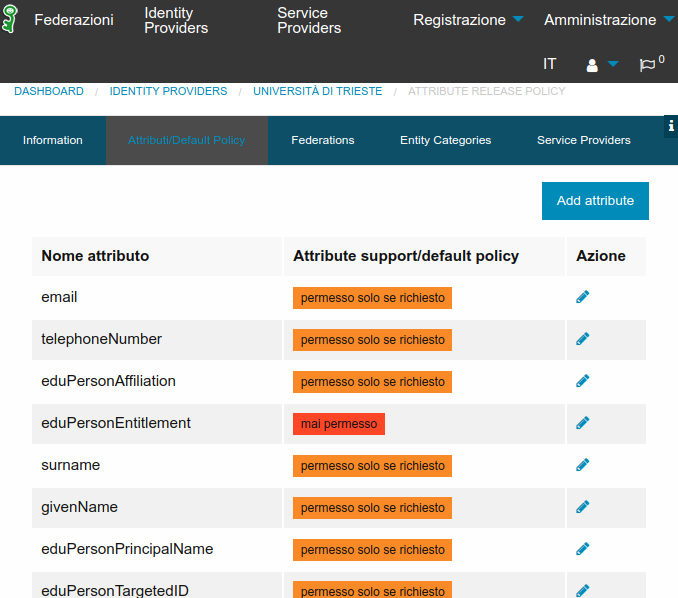
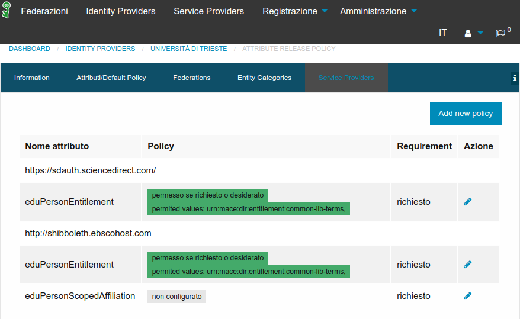

## eduPersonEntitlement: valori strettamente necessari agli SP

### Analisi e Premesse
La maggior parte degli IdP rilascia **tutti** o gran parte dei valori generati per l'attributo *eduPersonEntitlement* a **tutti** gli SP che ricihedono l'attributo stesso.

E' così che (ad esempio) collegandosi a Elsevier, questo viene a sapere che la mia organizzazione richiede certificati personali a Digicert e che il mio account è un account amministratore della registration authority, che la mia organizzazione utilizza i pacchetti di e-learning di Cineca U-gov e che utilizza i servizi di OCLC EzProxy in hosting.

Queste sono informazioni che da un lato possono potenzialmente influenzare strategie di mercato e dall'altro potrebbero non essere strettamente necessarie all'erogazione del servizio (GDPR).

Inoltre alcuni SP si "rompono" se non trovano SOLO il loro entitlement o se non lo trovano all'inizio o alla fine della lista.

### Perché viene rilasciata la lista completa
La best practice attuale prevede l'uso di AFP dinamiche come segue:

```xml
<value>%{idp.home}/conf/attribute-filter.xml</value>
<ref bean="IDEM-Default-Filter"/>
<ref bean="IDEM-Production-Filter"/>
<ref bean="ResearchAndScholarship"/>
<ref bean="CodeOfConduct"/>
```
Bisogna osservare un paio di cose:

1. Mancano delle policy esplicite per *"SP eduGAIN non CoCo e non R&S"* e di fatto risultano qundi inaccessibili a meno di policy apposite in *attribute-filter.xml*
2. in *IDEM-Production-Filter* e in *CodeOfConduct* ci sono le regole esplicite 

```xml
<AttributeRule attributeID="eduPersonEntitlement">
    <PermitValueRule xsi:type="AttributeInMetadata" onlyIfRequired="true" />
</AttributeRule>
```
che di fatto rilasciano TUTTI i valori di eduPersonEntitlement.
A tal proposito bisogna rilevare che l'ordine delle regole non sovrascrive di fatto il risultato finale (o lo nega definitivamente). Vedi https://wiki.shibboleth.net/confluence/display/IDP30/AttributeFilterConfiguration

```
During attribute filtering, the engine:

1. Examines all the <AttributeFilterPolicyGroup> elements provided (for instance across multiple files) in an unspecified order.
2. Examines all the <AttributeFilterPolicy> elements within each <AttributeFilterPolicyGroup>, again in an unspecified order.
3. For each policy, if the <PolicyRequirementRule> is true:
   * Applies each of the child <AttributeRule> elements, such that:
     * The attributes (and their values) returned by <PermitValueRule> get added to a "permit list".
     * The attributes (and their values) returned by <DenyValueRule> get added to a "deny list".
4. At the end of filtering, the final results are calculated by:
       * Populating the result initially from the permit list.
       * Removing all attribute values found in the deny list.
       * Removing all attributes with no values.

In this way, it can be seen that a <DenyValueRule> 'trumps' the result of a <PermitValueRule> in the manner typically found in such policy languages.
```


### Soluzione adottabile
In attesa di valutare tutti i problemi che puo' causare l'eliminazione della regola per *eduPersonEntitlement* in *IDEM-Production-Filter* e in *CodeOfConduct*, vi sono alcune soluzioni adottabili:

```xml
<ref bean="IDEM-Default-Filter"/>
<value>%{idp.home}/conf/attribute-filter-v3-required.xml</value>
<ref bean="FileBacked_RR_Garr_ARP"/>
<ref bean="ResearchAndScholarship"/>
<value>%{idp.home}/conf/attribute-filter-v3-coco.xml</value>
<value>%{idp.home}/conf/attribute-filter.xml</value>
```
Dove:

* *attribute-filter-v3-required.xml* e *attribute-filter-v3-coco.xml* sono versioni locali delle rispettive ARP con **eliminata** la parte di *eduPersonEntitlement*
* *FileBacked_RR_Garr_ARP* è il filtro generato dal Resource Registry GARR IDEM configurato come negli screenshot seguenti:



In particolare *eduPersonEntitlement* va impostato a `non configurato` (anche se poi il registry lo marca come `mai permesso`, di fatto non viene mai messo a deny).




* in *attribute-filter.xml*  vi sono tutte le configurazioni di *eduPersonEntitlement* per risorse **non federate** o di tutte le risorse nel caso si preferisca mantenere qui le eccezioni invece di usare il Resource registry. Esempio:

```xml
<!-- COMMON-LIB-TERMS per Elsevier (Ebsco Scopus ScienceDirect) -->
   <AttributeFilterPolicy id="release-common-lib-terms">
        <PolicyRequirementRule xsi:type="OR">
                <Rule xsi:type="Requester" value="https://sdauth.sciencedirect.com/" />
                <Rule xsi:type="Requester" value="https://shibboleth.ebscohost.com" />
        </PolicyRequirementRule>

        <AttributeRule attributeID="eduPersonEntitlement">
            <PermitValueRule xsi:type="Value" value="urn:mace:dir:entitlement:common-lib-terms" ignoreCase="true" />
        </AttributeRule>
   </AttributeFilterPolicy>


<!-- TERENA Certificate Services TCS certificati personali -->
   <AttributeFilterPolicy id="releaseToTCSpersonal">

        <PolicyRequirementRule xsi:type="AND">
           <Rule xsi:type="Requester" value="https://www.digicert.com/sso" />
           <Rule xsi:type="Value" attributeID="eduPersonAffiliation" value="staff"/>
        </PolicyRequirementRule>

        <AttributeRule attributeID="eduPersonEntitlement">
            <PermitValueRule xsi:type="ValueRegex" regex="^urn:mace:terena.org:tcs:.*$" />
        </AttributeRule>

        <AttributeRule attributeID="eduPersonPrincipalName">
            <PermitValueRule xsi:type="ANY" />
        </AttributeRule>
        <AttributeRule attributeID="schacHomeOrganization">
            <PermitValueRule xsi:type="ANY" />
        </AttributeRule>
        <AttributeRule attributeID="displayName">
            <PermitValueRule xsi:type="ANY" />
        </AttributeRule>
        <AttributeRule attributeID="mail">
            <PermitValueRule xsi:type="ANY" />
        </AttributeRule>
   </AttributeFilterPolicy>
```